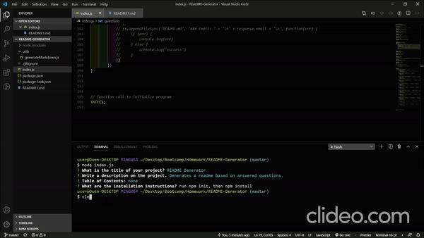

# README Generator
The README Generator creates a README file based on your answers to a set of questions.
## Table of Contents: 

## Installaion Instructions: 
Fork or clone the repo to your local machine. CD into the file and run 'nmp init -y' in the terminal. Then run 'npm install inquirer. 
## How to Use: 
Once the installation steps have been followed run 'node index.js' in your terminal and follw the prompts.

## License: 

## Other Contributors: 
None
## Explain How to Run Tests: 

## Questions: 
If the user has any questions, I can be contacted through Github or email.
gwensanabria
gwensanabria@gmail.com
